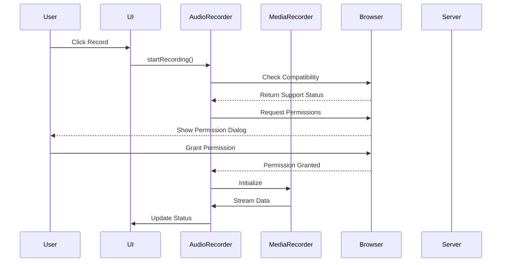

# Architecture Documentation

## 1. System Architecture Overview

### 1.1 High-Level Architecture
```
┌─────────────────────────┐
│      Client Browser     │
├─────────────────────────┤
│ ┌─────────┐ ┌─────────┐ │
│ │ Web     │ │ Audio   │ │
│ │ Audio   │←→│Recorder│ │
│ │ API     │ │ Class   │ │
│ └─────────┘ └─────────┘ │
└─────────┬───────────────┘
          ↓
┌─────────────────────────┐
│    Flask Application    │
└─────────────────────────┘
```

### 1.2 Component Interaction Flow


## 2. Error Handling Architecture

### 2.1 Error Handling Flow
```
┌────────────────┐     ┌────────────────┐     ┌────────────────┐
│   Try Block    │────►│  Error Handler │────►│  User Feedback │
└────────────────┘     └────────────────┘     └────────────────┘
        │                      │                      │
        ▼                      ▼                      ▼
┌────────────────┐     ┌────────────────┐     ┌────────────────┐
│ Recovery Logic │     │   Retry Logic  │     │  State Update  │
└────────────────┘     └────────────────┘     └────────────────┘
```

### 2.2 Error Categories and Handling

1. **Permission Errors**
```javascript
handlePermissionError(error) {
    switch(error.name) {
        case 'NotAllowedError':
            // Handle denied permission
            break;
        case 'NotFoundError':
            // Handle missing device
            break;
        case 'NotReadableError':
            // Handle device in use
            break;
        default:
            // Handle unknown errors
    }
}
```

2. **Compatibility Errors**
```javascript
checkCompatibility() {
    const requirements = [
        'MediaRecorder',
        'getUserMedia',
        'AudioContext'
    ];
    
    return requirements.every(feature => 
        feature in window || 
        feature in navigator.mediaDevices
    );
}
```

3. **Stream Errors**
```javascript
handleStreamError(error) {
    if (this.retryAttempts < this.maxRetryAttempts) {
        this.retryRecording();
    } else {
        this.handleFatalError(error);
    }
}
```

## 3. State Management

### 3.1 State Machine
```
┌──────────────┐
│    IDLE      │◄─────────────┐
└──────┬───────┘              │
       ▼                      │
┌──────────────┐     ┌───────┴──────┐
│ INITIALIZING │────►│   RECORDING   │
└──────────────┘     └───────┬──────┘
                             │
                     ┌───────▼──────┐
                     │  PROCESSING   │
                     └───────┬──────┘
                             │
                     ┌───────▼──────┐
                     │   FINISHED    │
                     └──────────────┘
```

### 3.2 State Transitions
```javascript
class AudioRecorder {
    constructor() {
        this.state = 'IDLE';
        this.transitions = {
            IDLE: ['INITIALIZING'],
            INITIALIZING: ['RECORDING', 'ERROR'],
            RECORDING: ['PROCESSING', 'ERROR'],
            PROCESSING: ['FINISHED', 'ERROR'],
            FINISHED: ['IDLE'],
            ERROR: ['IDLE']
        };
    }

    async transition(newState) {
        if (this.transitions[this.state].includes(newState)) {
            await this.cleanup(this.state);
            this.state = newState;
            await this.initialize(newState);
        }
    }
}
```

## 4. Security Architecture

### 4.1 Permission Management
```javascript
class PermissionManager {
    async requestPermission() {
        try {
            const stream = await navigator.mediaDevices
                .getUserMedia({ audio: true });
            return this.validateStream(stream);
        } catch (error) {
            this.handlePermissionError(error);
            return false;
        }
    }
}
```

### 4.2 Data Security
- Client-side only processing
- No data persistence
- Stream cleanup
- Secure state management

## 5. Performance Optimization

### 5.1 Resource Management
```javascript
class ResourceManager {
    cleanup() {
        this.releaseStreams();
        this.revokeObjectURLs();
        this.clearBuffers();
    }

    releaseStreams() {
        if (this.stream?.active) {
            this.stream.getTracks()
                .forEach(track => track.stop());
        }
    }
}
```

### 5.2 Memory Management
```javascript
handleRecording() {
    // Chunk size management
    const CHUNK_SIZE = 1024 * 1024; // 1MB
    if (this.audioChunks.length * CHUNK_SIZE > MAX_MEMORY) {
        this.processChunks();
    }
}
```

### 5.3 Performance Monitoring
```javascript
class PerformanceMonitor {
    constructor() {
        this.metrics = {
            startTime: 0,
            chunks: 0,
            memory: 0
        };
    }

    track() {
        this.updateMetrics();
        this.checkThresholds();
    }
}
```

## 6. Development Guidelines

### 6.1 Code Organization
```
src/
├── audio/
│   ├── recorder.js
│   ├── processor.js
│   └── permissions.js
├── ui/
│   ├── controls.js
│   └── feedback.js
└── utils/
    ├── compatibility.js
    └── error-handler.js
```

### 6.2 Error Handling Best Practices
1. Always implement fallbacks
2. Provide user feedback
3. Clean up resources
4. Log errors appropriately
5. Implement retry mechanisms

### 6.3 Testing Strategy
1. Unit Tests
   - Component functionality
   - Error handling
   - State transitions

2. Integration Tests
   - Browser compatibility
   - Format support
   - Permission handling

3. Performance Tests
   - Memory usage
   - CPU utilization
   - Resource cleanup

## 7. Future Enhancements

### 7.1 Planned Features
1. Multi-track recording
2. Audio processing
3. Format conversion
4. Noise reduction
5. Automatic gain control

### 7.2 Scalability Considerations
1. Worker thread processing
2. Streaming upload support
3. Cloud integration
4. Progressive enhancement
